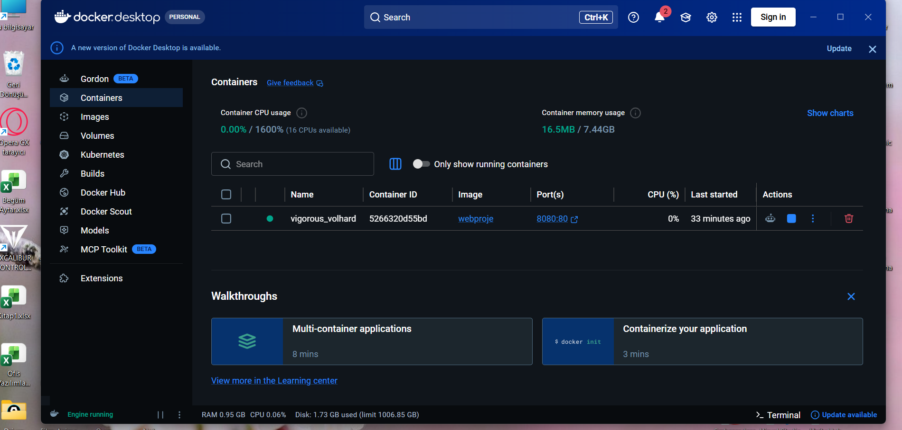

# Bulut Bilişim Dersi - Kişisel Web Sayfası

Bu proje, Bulut Bilişim dersi kapsamında Docker kullanılarak çalıştırılan ve GitHub Pages üzerinden yayınlanan kişisel bir web sayfasıdır.

* **Öğrenci Adı:** Begüm Aytar
* **Bölüm:** Bilgisayar Programcılığı
* **Kullanılan Teknolojiler:** HTML, CSS, Docker, GitHub, GitHub Pages 

## Docker Çalıştırma Komutları
Projeyi lokalde Docker üzerinden çalıştırmak için aşağıdaki komutlar kullanılmıştır:

1. Docker image oluşturmak için:
`docker build -t webproje .`

2. Docker container'ı çalıştırmak için:
`docker run -d -p 8080:80 webproje`

